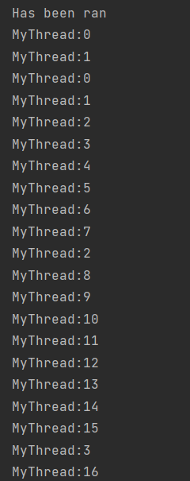
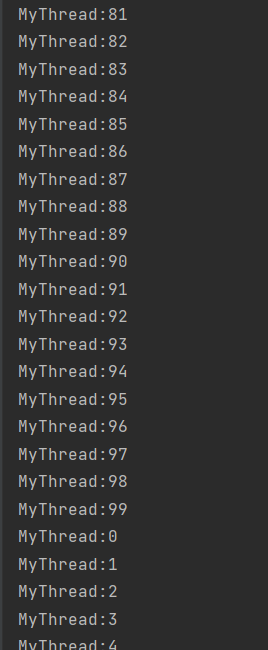

# 一、多线程技能

## 1. 多线程的使用

### Thread 方式

MyThread.java

```java
package threadTest;

public class MyThread extends Thread{
    @Override
    public void run(){
        super.run();
        for (int i = 0; i < 100; i++){
            System.out.println("MyThread:" + i);
        }
    }
}
```

Main.java

```java
package threadTest;

public class main {
    public static void main(String[] args){
        MyThread myThread = new MyThread();
        myThread.start();
        MyThread myThread1 = new MyThread();
        myThread1.start();
        System.out.println("Has been ran");
    }
}

```

### Runnable 方式

runnable 只有 run 接口，没有 start 方法；所以需要藉由 Thread 的构造来使用 start 开始线程。

MyRunnable.java

```java
package threadTest;

public class MyRunnable implements Runnable{
    @Override
    public void run(){
        System.out.println("Runnable");
    }
}

```

Run.java

```java
package threadTest;

public class Run {
    public static void main(String[] args) {
        Runnable runnable = new MyRunnable();
        Thread thread = new Thread(runnable);   //runnable has no 'start' method, so use thread to decorate(compact).
        thread.start();
        System.out.println("done");
    }
}
```


## 2. start() 与 run()

调用 start() 是通知了**线程规划器**该线程已经准备就绪，系统可以安排一个时间来调用 Thread 的 run() 方法，属于异步执行。

thread.run() 是同步执行，由调用发起者直接执行线程的 run 方法，执行完成才会进行下一步。

使用 start 表现出来是多线程，而调用 run 还是表现单线程。





## 3. Synchronized 关键字

 

## 4. 停止一个线程

- this.interrupted() 测试当前线程是否已经是中断状态，执行后把标志位设置为 false 。
- this.isInterrupted() 测试线程 Thread 是否已经中断，但不清除标志位。
- thread.interrupt()，run 方法中有sleep，使用try的 catch**可以捕捉到 InterruptedException **的。  

- 异常法停止一个线程，抛出 InterruptedException 。（推荐）
- thread.stop() 暴力停止，不推荐。
- 使用 return 停止线程。 

## 5. 暂停一个线程

- suspend 与resume
- 它们的缺陷：独占（不同步-）。如果子线程中有调用 synchronized 方法，将导致同步锁可能未被释放，在主线程调用相同 synchronized 方法时无法获得锁，程序卡住。

## 6. yield 方法 

thread.yield()

放弃当前 CPU 资源，让给其他任务去占用。（但放弃的时间不确定，可能很短）

牺牲自我，成就他人。

## 7. 线程优先级

A 调用 B ，则默认的， B 的优先级与 A 一致。

- 规则性，按优先级的高低来分配 CPU 资源，优先级 1-10 逐次增高。
- 随机性，优先级高的不一定先执行完，优先级高只是保证会被尽量多地分配运行资源。

```java
thread.setPriority(6);
```


## 8. 守护线程

线程分为：用户线程、守护线程

比如 GC

 当前 JVM 实例中，最后一个非守护线程结束了，守护线程才结束。

```java
thread.setDeamon(true)
```


# 二、对象及变量的并发访问

同步 synchronized，异步 asynchronized。

资源**共享**才需要**同步**。

被锁住的变量称为互斥区或临界区。

## 1. 单例模式下并发访问同一个对象的内容

synchnized 同步锁，使得调用方法变成**同步访问对象属性**。

## 2.多个对象多把锁

方法带有 synchronized 则一个对象带有一把锁，多个对象在 JVM 中是异步的，所以多个对象的多把锁表现为异步的。

## 3. 脏读

setValue() 时，中途进行 getValue() ，如果 getValue() 没有同步则可能出现脏读。

同步锁作用于对象，非同步方法可以异步调用，同一对象的多个同步方法是同步调用。

 ```java
 public class MyObject {
     private String userName = "A";
     private String password = "AA";
     synchronized public void setValue(String userName, String password){
         this.userName = userName;
         try {
             Thread.sleep(3000);//delay cause the dirtyRead
         }catch (Exception e){
 
         }
         this.password = password;
     }
 
     public void getValue(){
         System.out.println(this.userName + "," + this.password);
     }
 }
 ```


getValue() 加上同步之后不会有脏读

```java
public class MyObject {
    private String userName = "A";
    private String password = "AA";
    synchronized public void setValue(String userName, String password){
        this.userName = userName;
        try {
            Thread.sleep(3000);//delay cause the dirtyRead
        }catch (Exception e){

        }
        this.password = password;
    }
	//Add synchronized
    synchronized public void getValue(){
        System.out.println(this.userName + "," + this.password);
    }
}

```

## 4. synchronized 锁的重入

一个线程获得某个对象的锁，对象锁未释放时还想**再次获得锁**，是可以的。

如果锁不可重入，会造成死锁。

**子类可以通过“可重入锁”调用父类的同步方法。**

当前线程出现**异常**时，锁自动释放。

同步不具有继承性。

## 5. synchronized 的弊端

若 A 线程执行任务花的时间较长，那么 B 线程会等待较长时间。

- 可以使用**同步块**的方法来解决，同步块也是锁定对象。

  ```java
  synchronized(this){
      this.data = data;
  }
  ```

  只同步共用的部分。

## 6. 静态同步与 synchronized(class)

**静态同步锁定的是类。**

- 多个对象共用一把锁

  同一个类如果使用常量字符（常量字符串是存放在缓存中）串作为 synchronized(string) 对象监视器，并且对象 A 的同步方法中有死循环，那么其他对象无法调用该同步方法，表现为无限等待（**其他线程被锁住**）。

- 一个对象一把锁

  使用局部变量的方式可以避免锁住其他线程。

## 7. synchronized 无限等待

因为 synchronized 锁定的是对象，同一个对象的方法同步执行，当一个线程**执行某个方法存在死循环时**，其他线程会陷入无限等待。如下，thread 与 threadB 共用一个 service 。

```java
public class Service {
    synchronized public void service1(){
        System.out.println("service1");
        while (true){
            System.out.println("ha");
        }
    }
    synchronized public void service2(){
        System.out.println("service2");
    }
}
```

```java
public class MyThread extends Thread{
    Service service;
    public MyThread(Service service){
        this.service = service;
    }
    @Override
    public void run(){
        super.run();
        service.service1();
    }
}
```

```java
public class MyThreadB extends Thread{
    Service service;
    public MyThreadB(Service service){
        this.service = service;
    }
    @Override
    public void run(){
        super.run();
        service.service2();
    }
}
```

```java
public class Run {
    public static void main(String[] args) {
        Service service = new Service();//two threads use the same service. 
        MyThread myThread = new MyThread(service);
        myThread.start();
        MyThreadB myThreadB = new MyThreadB(service);
        myThreadB.start();
    }
}
```


解决方法：同步块并且对象监视器使用不同对象。一个方法对应一个对象监视器，做到单个方法的同步（锁住单个方法）。

```java
public class Service {
    Object object = new Object();
    public void service1(){
        synchronized(object){
            System.out.println("service1");
            while (true){
                System.out.println("ha");
            }
        }
    }
    Object object1 = new Object();
    public void service2(){
        synchronized (object1){
            System.out.println("service2");
        }
    }
}
```

## 8. 多线程死锁

死锁条件：

- 互斥
- 占有且等待
- 不可抢占
- 循环等待

以下举例了 4 秒钟的死锁，线程占有的时间越长，死锁时间越长。

```java
public class DealThread implements Runnable{
    public String username;
    public Object lock1 = new Object();
    public Object lock2 = new Object();
    public void setFlag(String username){
        this.username = username;
    }
    @Override
    public void run(){
        if (username.equals("a")){
            synchronized (lock1){
                System.out.println("username: " + username);
                try{
                    Thread.sleep(4000);//4 second dead lock
                }catch(Exception e){
                    e.printStackTrace();
                }
            }
            synchronized (lock2){
                System.out.println("lock2 username: "  + username);
            }
        }else if(username.equals("b")){
            synchronized (lock2){
                System.out.println("username: " + username);
                try{
                    Thread.sleep(4000);//4 second dead lock
                }catch(Exception e){
                    e.printStackTrace();
                }
            }
            synchronized (lock1){
                System.out.println("lock1 username: "  + username);
            }
        }
    }

}
```

